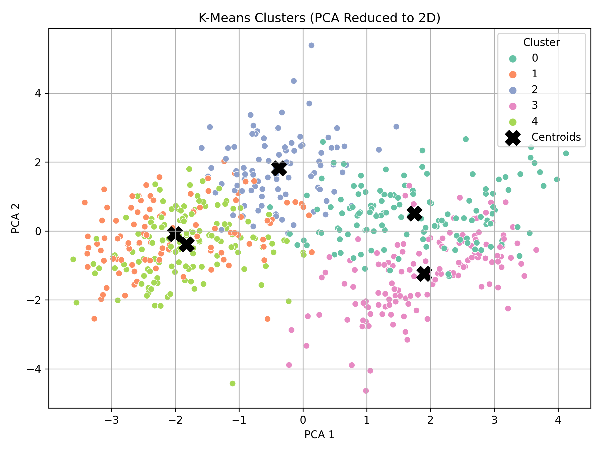
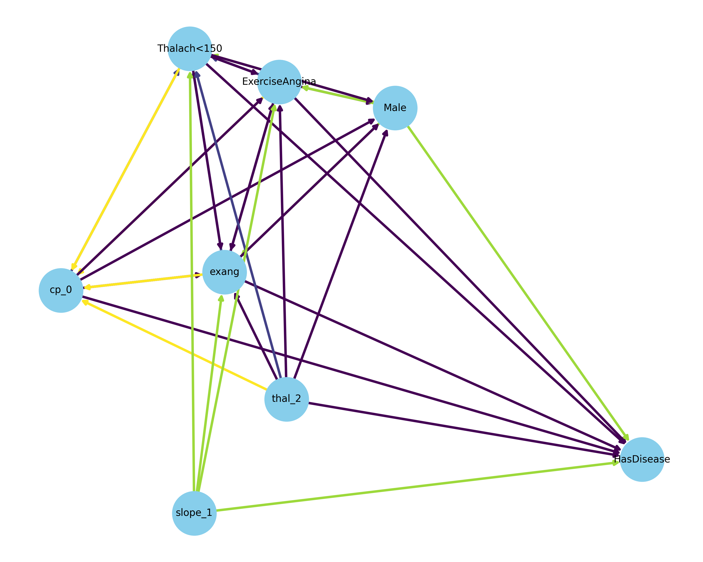

# Introduction

This project of Advanced Data Mining for Data-Driven insights and Predictive Modeling will guide through different key stages of the data mining process as mentioned below in 4 different deliverable parts.

* Deliverable 1: Data Collection, Cleaning, and Exploration
* Deliverable 2: Regression Modeling and Performance Evaluation
* Deliverable 3: Classification, Clustering, and Pattern Mining
* Deliverable 4: Final Insights, Recommendations, and Presentation

# Group Members

* Nischal Joshi
* Rutu Shah
* Murali Krishna
* Santhosh Ramachandran

# Deliverable 1: Data Collection, Cleaning, and Exploration

## Data-Driven-Insights-and-Predictive-Modeling

### Dataset Summary:

The data set consists of medical attributes gathered from patients in order to forecast the severity of heart disease. There are 16 main attributes like age, sex, chest pain type (cp), blood pressure (trestbps), cholesterol(chol), fasting blood sugar (fbs), resting ECG results (restecg), maximal heart rate achieved (thalach), exercise-induced angina (exang), ST depression (old peak),  slope of the peak exercise (slope), major number of blood vessles (ca) and thalassemia (thal),  predicated attribute(num).

**Key Insights from Analysis**

- The majority of patients belong to the age group of between 40 and 60 years.
- Males showed a higher frequency of  heart disease.
- Columns with *few missing values* (e.g., restecg, chol) can be imputed (mean/median/mode).
- Columns with *moderate missingness* (e.g., oldpeak, thalch, exang) can also be imputed if meaningful.
- Columns with *high missingness* (e.g., ca, thal, slope) may need to be dropped or carefully analyzed since much of the data is missing.
- **Rows**: 920
- **Columns**: 16
- **Source**: Kaggle

### Data Cleaning Used:

* **For Duplicates**:

  * For data cleaning the data set was diagnosed for missing values using  using `df.isnull().sum()`
  * Following are the column with missing values and their count:
    * trestbps : 59
    * chol: 30
    * fbs: 90
    * restecg: 2
    * thalach: 55
    * exang: 55
    * oldpeak: 62
    * slope: 309
    * ca: 611
    * thal: 486
      
* **For Duplicates**:

  * Detected using `df.duplicated()`
  * Removed duplicates using `df.drop_duplicates()`
    
* **For Data Exploration**:

  * Verified and corrected the data where necessary using `df.info()` and `df.astype()`.
    
* **Outliers and Noise**:

  * Visualized distributions using histograms and boxplots
  * Noted some outliers in cholesterol and max heart rate which were retained for modeling context
    
* **Challenges Faced:**
  * Selection of  the appropiate dataset from the kaggle.
    * Initial we worked in titanic dataset however it lacked the numerical attributes which is essential for further computation.
    * Later we worked with heart disease data set with a lot of numerical data.
  * Several columns in the dataset (e.g., trestbps, chol, fbs, restecg, thalach, exang, oldpeak, slope, ca, thal) contained missing values — some with very high missing rates (e.g., ca, thal, slope). This posed a  risk of losing too much data if all rows with missing values were dropped.
  * Outliers and unrealistic values were present in the numeric columns (age, chol) could bias the models and reduce performance.

# Deliverable 2: Regression Modeling and Performance Evaluation

For this deliverable, we have performed Regression modeling and performance evaluation covering below mentioned features

* Preprocessing and Feature Engineering
* Regression Models such as Linear Regression, Multiple Regression, and Ridge Regression Models
* Cross-validation techniques and
* Insights and Challenges faced

## Modeling Process

### 1. **Preprocessing and Feature Engineering**

- Unnecessay and irrelevant columns like `id`, `dataset`, and `target` were removed.
- Mean Strategy is used to fill in the missing values
- All  the numerical attributes were scaled with the help of  StandardScaler to normalize the input space.
- Categorical features were detected and one-hot encoded.
- The final dataset was split into training (80%) and testing (20%) sets.

### 2. **Regression Models Built**

- **Linear Regression**: A baseline regression model used for initial performance evaluation.
- **Ridge Regression**: A regularized model which adds L2 penalty to reduce model the complexity and improve generalization.

### Linear Regression Results:

- **R² Score**: 0.2630
- **MSE**: 396.92
- **RMSE**: 19.92
- **MAE**: 15.99

### Multiple Regression Results:
//TODO:

### Ridge Regression Results:

- **R² Score**: 0.2634
- **MSE**: 396.72
- **RMSE**: 19.91
- **MAE**: 15.99

### 5-Fold Cross-Validation:

| Model             | R² Scores                                | Average R² |
| ----------------- | ----------------------------------------- | ----------- |
| Linear Regression | [0.2205, 0.2726, 0.3026, 0.0187, -0.1525] | 0.1324      |
| Ridge Regression  | [0.2203, 0.2726, 0.3035, 0.0186, -0.1506] | 0.1329      |

## Key Insights

- The Linear as well as the Ridge regression models performed similarly, capturing only ~26% of the variance in the target variable.
- The RMSE of 19.91 implies moderately high prediction error, which reflects the limited linear correlation between features and the target.
- Cross-validation confirmed that both models were  generalized similarly, although some folds showed much lower R² (even negative), indicating variability in feature effectiveness.

## Challenges Faced

//TODO: 

# Deliverable 3: Classification, Clustering, and Pattern Mining

For this deliverable we have covered following concepts as mentioned below

* Classification Models
* hyperparameter tuning
* Evaluation of Classification model
* Clustering model and its visualization
* Association of Rule Mining Techniques
* Insights on how these patterns can be applied in real world

## Classification Models

### What is Classification?

Classification is a type of data analysis that extracts models describing data classes. These models are used to predict the class labels for new, unseen data points based on their features. In this project, we used a heart disease dataset to determine whether a patient is likely to have heart disease or not (binary classification: 0 = No Disease, 1 = Disease).

Models implemented here are KNN (K Nearest Neighbors) and Decision Tree.

### k-Nearest Neighbors (k-NN)

* KNN is a distance-based classifier that assigns a data point to the majority class among its k nearest neighbors.
* Operates on the principle that similar data points tend to belong to the same class.
* Tested for multiple k values to find optimal accuracy
* Sample code
  ```python
    from sklearn.neighbors import KNeighborsClassifier

    knn = KNeighborsClassifier(n_neighbors=5)
    knn.fit(X_train, y_train)
    y_pred = knn.predict(X_test)

  ```
* Best accuracy achieved: ~84% (at k=5 or higher)
* Evaluated using accuracy, confusion matrix, and ROC curve.

### Decision Tree

A Decision Tree is a flowchart-like tree structure where:

* Each internal (non-leaf) node represents a decision based on an attribute.
* Each branch represents the outcome of the test.
* Each leaf node represents a class label (target value).
* The root node is the starting point of the decision process.
* We have used the decision tree classifier from scikit-learn.

  ```python
  from sklearn.tree import DecisionTreeClassifier

  classifier = DecisionTreeClassifier()

  ```
* Train the classifier on the training dataset as mentioned below

  ```python
    classifier.fit(X_train, y_train)

  ```
* Predicted the outcomes for the test dataset.

  ```python
  classifier_y_pred = classifier.predict(X_test)

  ```
* Used evaluation metrics such as the confusion matrix and accuracy score.

  ```python
  from sklearn.metrics import confusion_matrix, accuracy_score

  print(confusion_matrix(y_test, classifier_y_pred))
  print('Accuracy:', accuracy_score(y_test, classifier_y_pred))

  ```
* Printed the decision tree rules in text form.

  ```python
    from sklearn import tree
    text_representation = tree.export_text(classifier)
    print(text_representation)

  ```
* Tree plot visualization

  ```python
  import matplotlib.pyplot as plt

  fig = plt.figure(figsize=(50,45))
  _ = tree.plot_tree(
      classifier,
      feature_names=feature_names,
      class_names=target_name,
      filled=True
  )

  ```

Summary of decision tree

* We achieved accuracy of: ~79%
* Confusion matrix, ROC curve, and tree visualization were generated to evaluate performance.

### 📈 Model Performance Comparison

| Model                      | Accuracy |
| -------------------------- | -------- |
| Decision Tree              | ~79%     |
| k-Nearest Neighbors (k-NN) | ~84%     |

Both models were effective in identifying patients at risk of heart disease,
with **k-NN showing slightly higher accuracy** in this dataset.
<<<<<<< HEAD
=======
=======
>>>>>>> a600b99c2f8d9549afcf066f59a09992a0fc2148

## Hyperparameter Tuning of Classification Models

We performed **hyperparameter tuning** for both **k-Nearest Neighbors (k-NN)** and **Decision Tree** classifiers using `GridSearchCV` to optimize their performance.

### k-Nearest Neighbors (k-NN)

- Parameter grid tested:

  - `n_neighbors`: [3, 5, 7, 9]
  - `weights`: ['uniform', 'distance']
  - `metric`: ['euclidean', 'manhattan']
- Best Parameters:

  - `n_neighbors`: 7
  - `weights`: distance
  - `metric`: manhattan
- Best cross-validated score: **~0.877**
- Final evaluation on test data:

  - **Accuracy:** 0.841
  - **Precision:** 0.882
  - **Recall:** 0.882
  - **F1 Score:** 0.882

### Decision Tree

- Parameter grid tested:

  - `max_depth`: [3, 5, 10, None]
  - `min_samples_split`: [2, 5, 10]
  - `criterion`: ['gini', 'entropy']
- Best Parameters:

  - `max_depth`: 3
  - `min_samples_split`: 2
  - `criterion`: gini
- Best cross-validated score: **~0.831**
- Final evaluation on test data:

  - **Accuracy:** 0.781
  - **Precision:** 0.856
  - **Recall:** 0.814
  - **F1 Score:** 0.834

---

### Insights for hyperparameter

- Hyperparameter tuning improved the performance of both models.
- k-NN achieved higher test accuracy and F1 score compared to Decision Tree on this dataset.
- ROC curves and confusion matrices were plotted to visualize model performance.

<<<<<<< HEAD
>>>>>>> 56fccf0ae59d5acf0aa59543264d942b9c407ebd
>>>>>>>
>>>>>>
>>>>>
>>>>
>>>
>>
=======
## Clustering and Association Rule Mining Summary

### Clustering with K-Means

We implemented a **K-Means clustering model** to identify natural groupings in the dataset based on patient attributes.

### Model Details:
- Scaled the dataset using `StandardScaler`.
- Applied K-Means with `n_clusters=5` and `random_state=42`.
- Assigned cluster labels to each patient in the dataset.

### Visualization:
To visualize the clusters:
- Performed PCA to reduce dimensions to 2D.
- Plotted the clusters using a scatter plot, with cluster centroids marked as black 'X'.



The clusters represent distinct patient profiles based on features such as age, blood pressure, cholesterol, etc. These groupings can help medical practitioners target specific risk groups for preventive measures.

---

## Association Rule Mining with FP-Growth

We applied **Frequent Pattern Growth (FP-Growth)** to discover meaningful patterns between patient characteristics and heart disease.

### Steps:
- Converted relevant features into binary (0/1) representation.
- Created derived attributes such as:
  - Age > 60
  - Blood pressure > 130
  - Cholesterol > 240
  - Maximum heart rate < 150
  - Presence of disease (`HasDisease`)
- Applied FP-Growth with a minimum support of 0.2.
- Extracted association rules with confidence ≥ 0.6 and focused on rules where the consequent includes `HasDisease`.

### Example Rules:
| Antecedents                | Consequent   | Support | Confidence | Lift  |
|----------------------------|--------------|---------|------------|-------|
| BP>130                     | HasDisease   | 0.31    | 0.70       | 1.09 |
| Male, BP>130               | HasDisease   | 0.27    | 0.78       | 1.22 |
| Thalach<150, BP>130        | HasDisease   | 0.25    | 0.85       | 1.33 |
| Thalach<150, Male, BP>130  | HasDisease   | 0.22    | 0.90       | 1.39 |

### Visualizations:
- **Top 10 Rules by Lift:** Bar chart of strongest rules.
- **Network Graph:** Directed graph of antecedents → consequent with edge weight representing lift.
- **Support vs Confidence:** Scatter plot with lift shown as color gradient.



---

## Real-World Insights

The discovered patterns highlight important risk factors for heart disease:
- Patients with **high blood pressure** and **maximum heart rate < 150** are at much higher risk.
- Male patients with these risk factors have even higher likelihood of disease.

These insights can assist healthcare providers in:
- Prioritizing screening and intervention for high-risk patients.
- Designing targeted awareness campaigns and lifestyle interventions.
- Informing policy decisions on resource allocation for preventive care.

---

## Conclusion

We successfully:
✅ Developed and visualized a **clustering model (K-Means)**  
✅ Identified and explained patient groups based on feature similarity  
✅ Applied **FP-Growth** to find significant association rules predicting heart disease  
✅ Provided actionable insights applicable in medical settings

---
>>>>>>> a600b99c2f8d9549afcf066f59a09992a0fc2148
